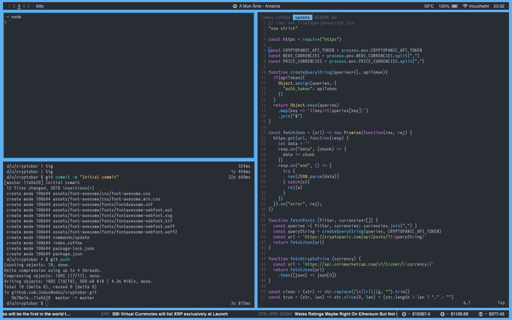

# Cryptobar
Cryptobar is an [Übersicht](https://github.com/felixhageloh/uebersicht) widget that shows the trending crypto news from [CryptoPanic](https://cryptopanic.com) and the current prices from [CoinMarketCap](https://coinmarketcap.com).

## Requirements
- [Übersicht](https://github.com/felixhageloh/uebersicht) installed
- [CryptoPanic](https://cryptopanic.com) account
- [NodeJS](https://nodejs.org/en/) v8 or up

## Installation
1. Clone or download and unzip it in your Übersicht widget folder (it is important that the subfolder is called "cryptobar").
2. Open `cryptopanic/index.coffee` with an editor and complete the configuration.

## Screenshot

The upper status bar is [Bar](https://github.com/JodusNodus/bar).
The terminals are [kitty](https://github.com/kovidgoyal/kitty).
